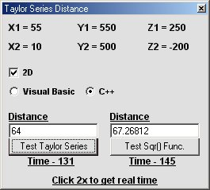



## Taylor Series VS Sqr\(\) Distance Testing \(2D & 3D\) \(\*UPDATE\*\)

### Description

Thanks to Robert Rayment the VB version of TaylorDistance3D works right now.

This is another way to test for distance if you don't like to use the Sqr() Function. Its the Taylor/Maclaurin Series. The only problem is theres a Max Error of 3.5% in 2D and a Max error of 8.0% in 3D. So if you need exact accuracy don't use this. This can also be found in Andre LaMothe's Book. "Tricks Of The Windows Game Programming Gurus" Enjoy. -James-
 
### More Info
 

             |
---                |---
**Submitted On**   |2002-09-20 14:38:12
**By**             |[James Dougherty](https://github.com/Planet-Source-Code/PSCIndex/blob/master/ByAuthor/james-dougherty.md)
**Level**          |Intermediate
**User Rating**    |5.0 (15 globes from 3 users)
**Compatibility**  |VB 6\.0
**Category**       |[Games](https://github.com/Planet-Source-Code/PSCIndex/blob/master/ByCategory/games__1-38.md)
**World**          |[Visual Basic](https://github.com/Planet-Source-Code/PSCIndex/blob/master/ByWorld/visual-basic.md)
**Archive File**   |[Taylor\_Ser1338169202002\.zip](https://github.com/Planet-Source-Code/james-dougherty-taylor-series-vs-sqr-distance-testing-2d-3d-update__1-39143/archive/master.zip)

